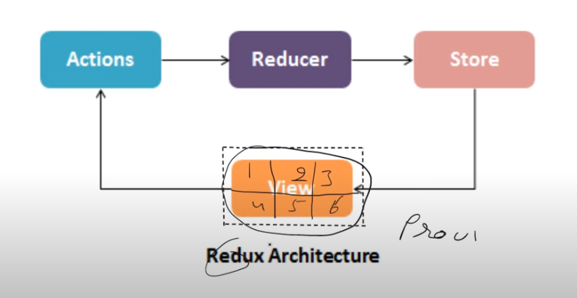

# How to add redux to project

1. Make all files (Action, Reducer, Store)
2. Make wrapper around react app
3. Create Store



Recall the view sends actions, which go to a reducer, which update the global store and dispatch back to the view.

### actions

Actions are plain functions, they egt data from react js and then send the data to the reducer. Must have a type key in the return statement.

- Return statements MUST have a type key
- Action and reducer are identified by the type
- we have a root reducer to add all the reducers together
- We use useDispatch to dispatch actions to the global store!

### Reducers explained

- Reducers handle data for the store, they are used to update data in the store
- Rules

1. Need a root reducer (the store only interacts with one reducer). Hence we need to combine our reducers/
2. Reducer must return some value/ Otherwise will throw errors
3. The reducer must have initial values.

- the default case for a reducer should not be blank, we should pass the data back to it.

### Get data in component from redux

- Getting and sending data!
- To use data from the store in a component we use useSelector!

### Redux toolkit

- We use toolkit because create store is deprecated!

### Redux saga

- Redux actions don't accept promises.
- First we have to configure the saga middleware
- We use saga to call APIs.
- We cannot directly call APIs within the action. We need a seperate saga file.
- View -> Action -> API -> Reducer -> Store -> View.
- We cannot call APIs in the actions because actions cannot handle async data.
- We call SAGAS with the help of the type.
- takeEvery will call every function with the name of the selected type.
- When we use generator functions we need to write yield.

1. create generator function. The \* indicates that we are dealing with a generator function.

### Creating a mock local API

1. install JSON server

```
   npm install -g json-server
```

2. Create a file simialr to the one below. File is a .json file

```
{
  "products": [
    {
      "id": 1,
      "name": "Samsung Galaxy s12",
      "color": "Black",
      "price": 150,
      "Category": "mobile",
      "brand": "Samsung Galaxy"
    },
    {
      "id": 2,
      "name": "Samsung Galaxy s11",
      "color": "White",
      "price": 100,
      "Category": "mobile",
      "brand": "Samsung Galaxy"
    },
    {
      "id": 3,
      "name": "Samsung Galaxy s10",
      "color": "Orange",
      "price": 120,
      "Category": "mobile",
      "brand": "Samsung Galaxy"
    }
]
}

```

3. CD into the folder wth the file and type the below command.

```
json-server --watch db.json --port 3500
```
